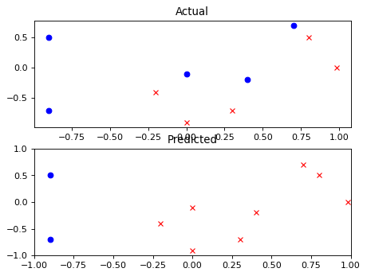
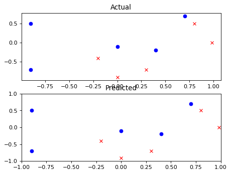

In this problem, we will implement (a) a weak learner and (b) a method for combining weak learners. In particular, you will implement Adaboost for decision stumps. A decision stump is a one level decision tree, i.e it looks at a single feature, then it makes a classification by thresholding on that feature.

Learning a decision stump requires learning a threshold in each dimension and then picking the best one. To learn a threshold in a dimension, simply sort the data in the chosen dimension, and calculate the loss on each candidate threshold (candidates are values between one point and the next, as well as the boundaries of your range of inputs).

Adaboost is described in the slides, and the concept is simple, based on a few repeated steps.

	-  Learn a weak classifier, given data and weights on the importance of each data point.
	-  Append the weak classifier to a set of classifiers. Give it a weight based on how useful it is
	-  Reweight difficult examples so the next weak classifier can learn them
	- Run the adaboost algorithm and experiment with the number of classifiers. Plot your output using the function given in the setup code, for n_classifiers = 1, 2 and 5.
	

